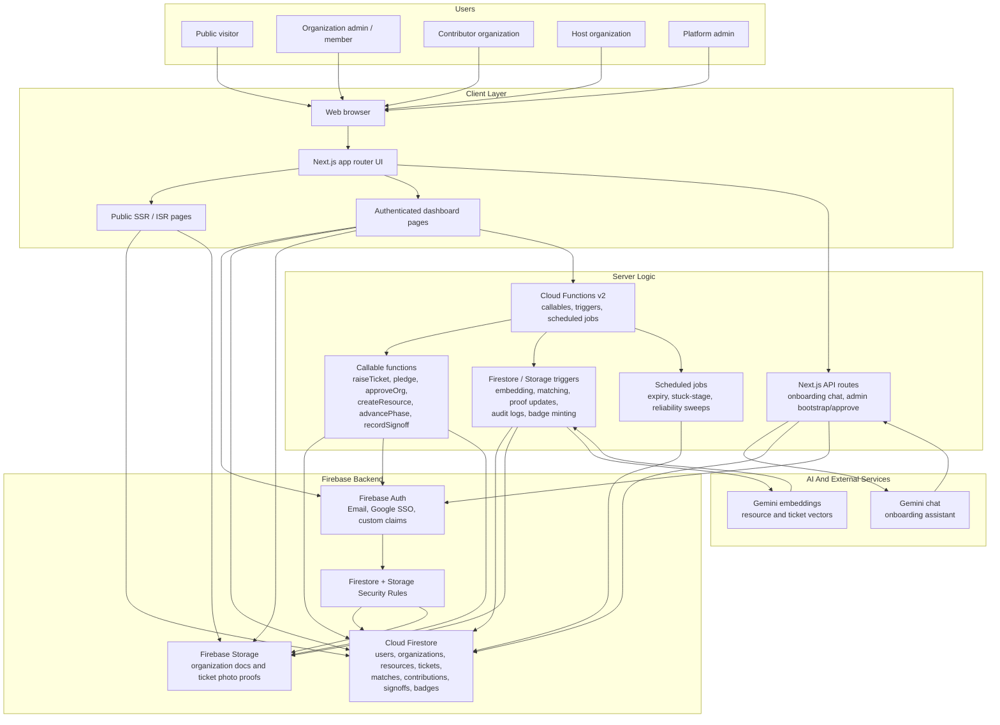
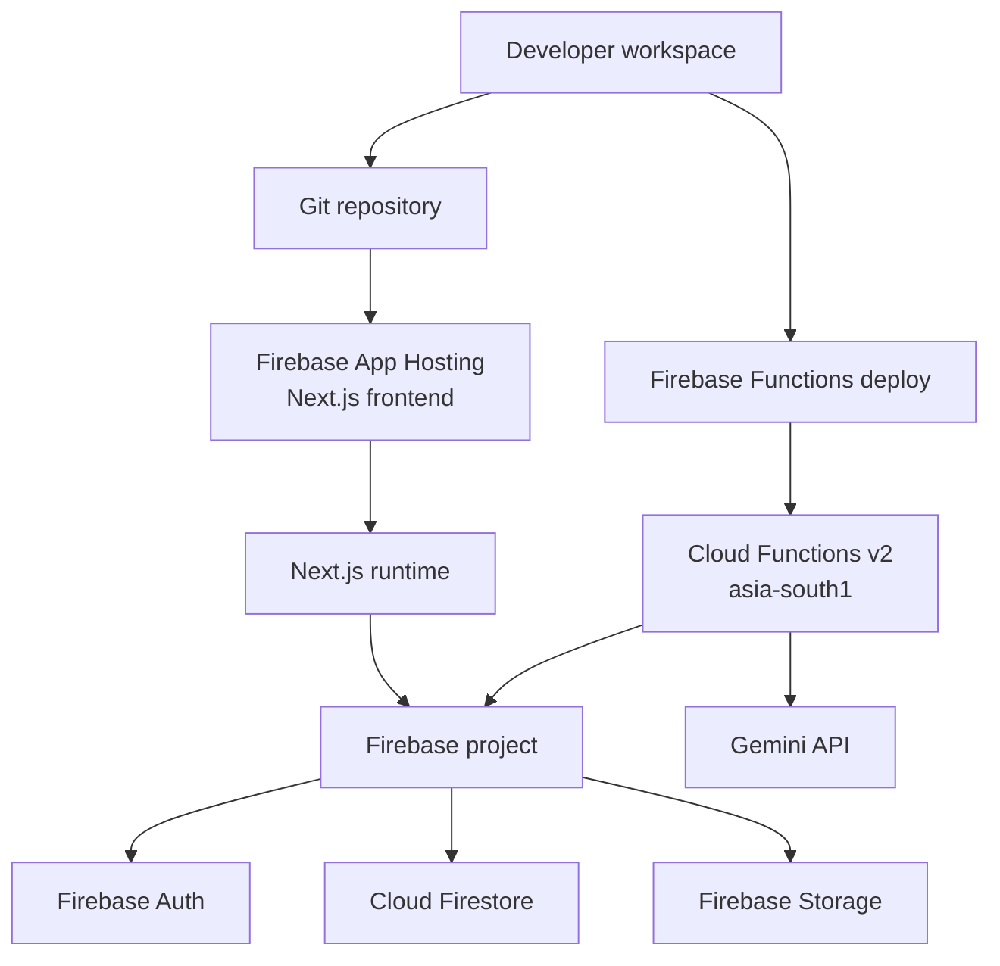

# Architecture Diagram Of The Proposed Solution

Nexus uses a Next.js web app with Firebase as the application backend. Firebase Auth handles identity, Firestore stores operational data, Firebase Storage stores verification and proof images, Cloud Functions enforce sensitive workflows, and Gemini APIs power onboarding assistance plus semantic matching.

## High-Level Architecture

## Core Data And Control Flow

```mermaid
flowchart LR
  Signup["Sign up / login"] --> Auth["Firebase Auth"]
  Auth --> UserDoc["users/{uid}"]

  UserDoc --> Onboard["Onboarding form or chat"]
  Onboard --> OrgDoc["organizations/{uid}\nPENDING_REVIEW"]
  Onboard --> GovtDocs["Storage: govt docs"]

  OrgDoc --> AdminReview["Platform admin review"]
  AdminReview --> Approve["approveOrg callable"]
  Approve --> ActiveOrg["organizations/{orgId}\nACTIVE + custom claims"]

  ActiveOrg --> ResourceForm["Resource management"]
  ResourceForm --> CreateResource["createResource callable"]
  CreateResource --> ResourceDoc["resources/{resourceId}"]
  ResourceDoc --> ResourceTrigger["onResourceCreated / onResourceUpdated"]
  ResourceTrigger --> ResourceVector["Gemini embedding"]
  ResourceVector --> ResourceReady["embeddingStatus: ok"]

  ActiveOrg --> TicketForm["Raise ticket"]
  TicketForm --> RaiseTicket["raiseTicket callable"]
  RaiseTicket --> TicketDoc["tickets/{ticketId}\nOPEN_FOR_CONTRIBUTIONS"]
  TicketDoc --> TicketTrigger["onTicketCreated / onRapidTicketCreated"]
  TicketTrigger --> TicketVector["Gemini embedding"]
  ResourceReady --> MatchEngine["Matching engine"]
  TicketVector --> MatchEngine
  MatchEngine --> MatchDocs["matches/{ticketId__orgId}"]

  MatchDocs --> Dashboard["Recommended dashboard"]
  Dashboard --> Pledge["pledge callable"]
  Pledge --> Contribution["tickets/{id}/contributions/{cid}"]
  Contribution --> Inventory["reservedQuantity / progress updates"]
  Inventory --> ActiveTickets["Active tickets dashboard"]

  ActiveTickets --> Execution["advancePhase to EXECUTION"]
  Execution --> ProofUpload["Upload photo proof"]
  ProofUpload --> ProofStorage["Storage: photo proof"]
  ProofUpload --> ProofDoc["tickets/{id}/photoProofs/{pid}"]
  ProofDoc --> PendingSignoff["advancePhase to PENDING_SIGNOFF"]

  PendingSignoff --> Signoff["recordSignoff callable"]
  Signoff --> SignoffDoc["tickets/{id}/signoffs/{orgId}"]
  SignoffDoc --> CloseTrigger["onSignoffRecorded"]
  CloseTrigger --> ClosedTicket["tickets/{id}: CLOSED"]
  ClosedTicket --> BadgeTrigger["onTicketClosed"]
  BadgeTrigger --> Badges["badges/{ticketId__orgId}"]
  BadgeTrigger --> FinalInventory["Commit or refund inventory"]
  Badges --> PublicImpact["Public ticket page and org profile"]
```

## Component Responsibilities

| Layer | Component | Responsibility |
| --- | --- | --- |
| Client | Next.js app router | Public pages, auth pages, dashboard, tickets, resources, profile, admin console |
| Auth | Firebase Auth | Login, Google SSO, identity tokens, custom claims for `orgId` and platform admin role |
| Data | Cloud Firestore | Source of truth for organizations, resources, tickets, matches, contributions, signoffs, badges, audit logs |
| Files | Firebase Storage | Government documents and ticket photo proof uploads |
| Backend | Cloud Functions callables | Server-authoritative validation and mutations for approval, resources, tickets, pledges, phase changes, signoffs |
| Backend | Cloud Functions triggers | Embeddings, matching, audit logs, photo-proof updates, close detection, badge minting, inventory commit/refund |
| AI | Gemini API | Onboarding chat and semantic embeddings for resources and tickets |
| Security | Firestore and Storage rules | Prevent unauthorized reads/writes, enforce user/org ownership, keep server-only fields protected |
| Public proof | SSR / ISR public pages | Render closed tickets, impact stories, public badges, and organization profiles |

## Deployment View

