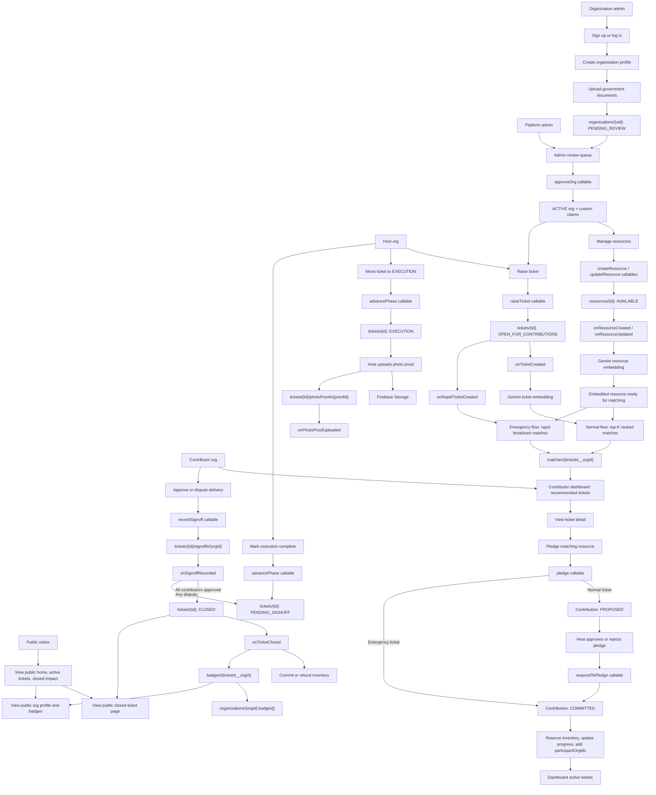
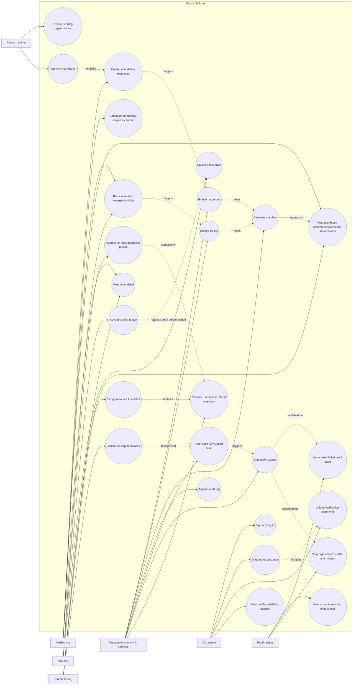
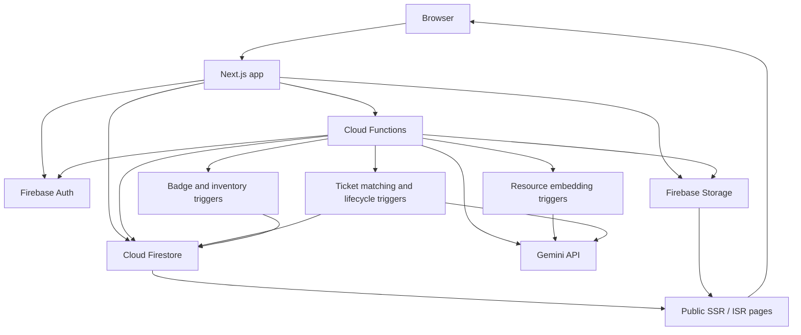
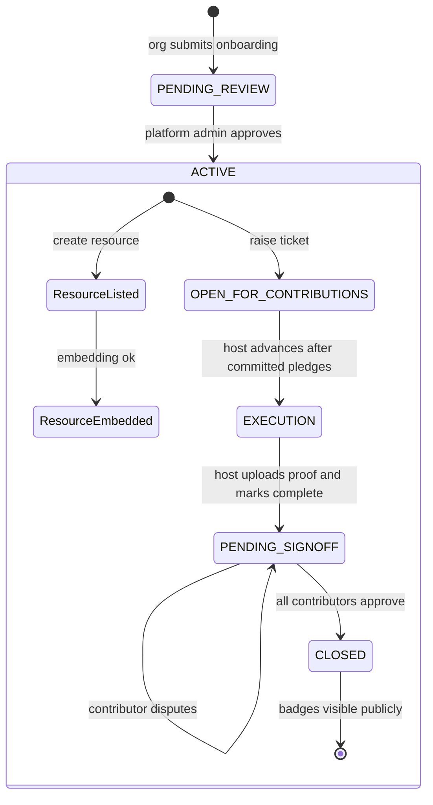

# Nexus Flow And Use Case Diagrams

Nexus is a verified organization-to-organization resource allocation platform. It connects approved NGOs and organizations, lets hosts raise resource tickets, uses AI-assisted matching to recommend contributor resources, tracks delivery proof, and publishes closed impact with badges.

## Project Flow Diagram

## Use Case Diagram

## Architecture Context

## Main Lifecycle States

