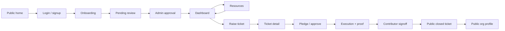

# Nexus Wireframes And Mock Diagrams

Low-fidelity screen wireframes for the proposed Nexus solution. These are intentionally simple so the core product flow is easy to understand: discover impact, verify organizations, list resources, raise tickets, match contributors, track execution, and publish proof.

## 1. Public Home

```text
┌────────────────────────────────────────────────────────────────────────────┐
│ NEXUS                                      About   Login   Sign up          │
├────────────────────────────────────────────────────────────────────────────┤
│                                                                            │
│  FEATURED IMPACT STORIES                                                   │
│  ┌──────────────────────────────────────────────────────────────────────┐  │
│  │ Large story image / carousel                                         │  │
│  │ Title of recent relief work                                          │  │
│  │ Impact numbers: lives impacted | value delivered | contributors      │  │
│  └──────────────────────────────────────────────────────────────────────┘  │
│                                                                            │
│  ACTIVE TICKETS                                                            │
│  ┌───────────────┐ ┌───────────────┐ ┌───────────────┐                    │
│  │ Ticket card   │ │ Ticket card   │ │ Ticket card   │                    │
│  │ Need summary  │ │ Need summary  │ │ Need summary  │                    │
│  │ Region/status │ │ Region/status │ │ Region/status │                    │
│  └───────────────┘ └───────────────┘ └───────────────┘                    │
│                                                                            │
│  RECENTLY CLOSED                                                           │
│  ┌───────────────┐ ┌───────────────┐ ┌───────────────┐                    │
│  │ Proof image   │ │ Proof image   │ │ Proof image   │                    │
│  │ Badge count   │ │ Badge count   │ │ Badge count   │                    │
│  └───────────────┘ └───────────────┘ └───────────────┘                    │
└────────────────────────────────────────────────────────────────────────────┘
```

Purpose: let any visitor understand current needs and verified completed impact.

## 2. Login And Signup

```text
┌──────────────────────────────────────────────────────────────┐
│ NEXUS                                                        │
├──────────────────────────────────────────────────────────────┤
│                                                              │
│             Sign in to your Nexus organization               │
│                                                              │
│             ┌──────────────────────────────────┐             │
│             │ Email                            │             │
│             ├──────────────────────────────────┤             │
│             │ Password                         │             │
│             └──────────────────────────────────┘             │
│                                                              │
│             [ Sign in ]                                      │
│             [ Continue with Google ]                         │
│                                                              │
│             New here? Create your Nexus account              │
│                                                              │
└──────────────────────────────────────────────────────────────┘
```

Purpose: authenticate organization users before allowing onboarding, resource listing, tickets, or pledges.

## 3. Organization Onboarding

```text
┌────────────────────────────────────────────────────────────────────────────┐
│ NEXUS                                           Dashboard  Resources  ...   │
├────────────────────────────────────────────────────────────────────────────┤
│                                                                            │
│  Set up your organization                                                  │
│                                                                            │
│  ┌─────────────────────────────┐   ┌────────────────────────────────────┐  │
│  │ Entity selector              │   │ Onboarding form / chat assistant   │  │
│  │ ○ NGO                        │   │                                    │  │
│  │ ○ Organization               │   │ Legal name                         │  │
│  │                              │   │ Email / phone                      │  │
│  │ Steps                        │   │ Region / operating areas           │  │
│  │ 1. Details                   │   │                                    │  │
│  │ 2. Documents                 │   │ Government document upload         │  │
│  │ 3. Review                    │   │ ┌──────────────┐ ┌──────────────┐ │  │
│  └─────────────────────────────┘   │ │ PAN / GST    │ │ Reg cert     │ │  │
│                                    │ └──────────────┘ └──────────────┘ │  │
│                                    │                                    │  │
│                                    │ [ Submit for review ]              │  │
│                                    └────────────────────────────────────┘  │
│                                                                            │
└────────────────────────────────────────────────────────────────────────────┘
```

Purpose: create `organizations/{uid}` with `PENDING_REVIEW` and upload verification documents.

## 4. Platform Admin Review

```text
┌────────────────────────────────────────────────────────────────────────────┐
│ Admin Console                                                              │
├────────────────────────────────────────────────────────────────────────────┤
│                                                                            │
│  Pending organization reviews                                              │
│                                                                            │
│  ┌──────────────┬──────────┬─────────────┬───────────────┬──────────────┐ │
│  │ Organization │ Type     │ Region      │ Documents     │ Action       │ │
│  ├──────────────┼──────────┼─────────────┼───────────────┼──────────────┤ │
│  │ ABC NGO      │ NGO      │ Dharwad     │ PAN, 80G      │ [ Approve ]  │ │
│  │ Relief Co    │ ORG      │ Bengaluru   │ GST, CIN      │ [ Approve ]  │ │
│  └──────────────┴──────────┴─────────────┴───────────────┴──────────────┘ │
│                                                                            │
│  Approval sets org status ACTIVE and refreshes custom claims.              │
│                                                                            │
└────────────────────────────────────────────────────────────────────────────┘
```

Purpose: allow platform admins to approve verified organizations before they can list resources, raise tickets, or pledge.

## 5. Dashboard

```text
┌────────────────────────────────────────────────────────────────────────────┐
│ NEXUS               Dashboard   Tickets   Resources   Profile    Raise     │
├────────────────────────────────────────────────────────────────────────────┤
│                                                                            │
│  Dashboard                                                                 │
│  ┌──────────────────────────────────────────────────────────────────────┐  │
│  │ Profile summary: org status, reliability, badges, region             │  │
│  └──────────────────────────────────────────────────────────────────────┘  │
│                                                                            │
│  [ Raise a ticket ]                                                        │
│                                                                            │
│  ┌───────────────────────────────────────┐ ┌────────────────────────────┐ │
│  │ Recommended for you                   │ │ Active tickets              │ │
│  │ AI-generated matches from resources   │ │ Tickets where org is host   │ │
│  │                                       │ │ or contributor              │ │
│  │ ┌───────────────────────────────────┐ │ │ ┌────────────────────────┐ │ │
│  │ │ Ticket card                       │ │ │ │ Active ticket row      │ │ │
│  │ │ match score | distance | impact   │ │ │ │ role | phase | status  │ │ │
│  │ │ [ View ]                          │ │ │ └────────────────────────┘ │ │
│  │ └───────────────────────────────────┘ │ │                            │ │
│  └───────────────────────────────────────┘ └────────────────────────────┘ │
│                                                                            │
└────────────────────────────────────────────────────────────────────────────┘
```

Purpose: give verified organizations a single home for recommendations and ongoing work.

## 6. Resource Management

```text
┌────────────────────────────────────────────────────────────────────────────┐
│ Resources                                                       [+ New]     │
├────────────────────────────────────────────────────────────────────────────┤
│                                                                            │
│  Resource list                                                             │
│  ┌──────────────┬─────────────┬──────────┬──────────────┬──────────────┐  │
│  │ Title        │ Category    │ Quantity │ Availability │ Embedding    │  │
│  ├──────────────┼─────────────┼──────────┼──────────────┼──────────────┤  │
│  │ School desks │ MATERIAL    │ 200      │ 30 days      │ Embedded     │  │
│  │ Funds pool   │ FUNDS       │ 100000   │ 14 days      │ Processing   │  │
│  └──────────────┴─────────────┴──────────┴──────────────┴──────────────┘  │
│                                                                            │
│  New / edit resource                                                       │
│  ┌──────────────────────────────────────────────────────────────────────┐  │
│  │ Category | title | quantity | unit | valuation                       │  │
│  │ Available from / until                                               │  │
│  │ Service region: lat, lng, radius                                     │  │
│  │ Emergency opt-in: enabled, max quantity, auto notify                 │  │
│  │ [ List resource ]                                                    │  │
│  └──────────────────────────────────────────────────────────────────────┘  │
│                                                                            │
└────────────────────────────────────────────────────────────────────────────┘
```

Purpose: maintain the resource inventory that drives AI matching and emergency broadcast eligibility.

## 7. Raise Ticket

```text
┌────────────────────────────────────────────────────────────────────────────┐
│ Raise a ticket                                                             │
├────────────────────────────────────────────────────────────────────────────┤
│                                                                            │
│  ┌──────────────────────────────────────────────────────────────────────┐  │
│  │ Title                                                                │  │
│  │ Description: what is needed and why                                  │  │
│  │ Category                         Urgency: Normal / Emergency         │  │
│  └──────────────────────────────────────────────────────────────────────┘  │
│                                                                            │
│  Needs                                                                     │
│  ┌──────────────────────────────────────────────────────────────────────┐  │
│  │ Need #1: resource category | quantity | unit | valuation             │  │
│  │ Host self pledge quantity / valuation / percent                      │  │
│  └──────────────────────────────────────────────────────────────────────┘  │
│  [ + Add need ]                                                            │
│                                                                            │
│  Location and deadline                                                     │
│  ┌──────────────────────────────────────────────────────────────────────┐  │
│  │ Region | latitude | longitude | deadline                             │  │
│  └──────────────────────────────────────────────────────────────────────┘  │
│                                                                            │
│  [ Raise ticket ]                                                          │
│                                                                            │
└────────────────────────────────────────────────────────────────────────────┘
```

Purpose: create a structured problem unit that can be matched against available resources.

## 8. Ticket Detail

```text
┌────────────────────────────────────────────────────────────────────────────┐
│ Ticket detail                                                              │
├────────────────────────────────────────────────────────────────────────────┤
│                                                                            │
│  ┌──────────────────────────────────────────────────────────────────────┐  │
│  │ Ticket title                                            Phase chip   │  │
│  │ Host org | urgency | region | deadline                               │  │
│  │ Overall progress bar                                                 │  │
│  └──────────────────────────────────────────────────────────────────────┘  │
│                                                                            │
│  ┌──────────────────────────────────────┐ ┌─────────────────────────────┐ │
│  │ Needs breakdown                       │ │ Your contribution potential │ │
│  │ Need category                         │ │ Best matching resource      │ │
│  │ Required / fulfilled / remaining      │ │ Max contribution possible   │ │
│  │ Progress per need                     │ │ Impact percentage           │ │
│  └──────────────────────────────────────┘ └─────────────────────────────┘ │
│                                                                            │
│  Contributor action                                                        │
│  ┌──────────────────────────────────────────────────────────────────────┐  │
│  │ Select resource | quantity | notes                                   │  │
│  │ Normal: [ Submit for approval ]                                      │  │
│  │ Emergency: [ Commit pledge now ]                                     │  │
│  └──────────────────────────────────────────────────────────────────────┘  │
│                                                                            │
│  Host controls                                                             │
│  ┌──────────────────────────────────────────────────────────────────────┐  │
│  │ Proposed pledges: approve / reject                                   │  │
│  │ Move to execution                                                    │  │
│  │ Upload photo proof                                                   │  │
│  │ Mark execution complete                                              │  │
│  └──────────────────────────────────────────────────────────────────────┘  │
│                                                                            │
│  Tabs: Contributions | Proof | Activity                                    │
│                                                                            │
└────────────────────────────────────────────────────────────────────────────┘
```

Purpose: show the complete lifecycle surface for pledge, execution proof, signoff, and closure.

## 9. Signoff And Closure

```text
┌────────────────────────────────────────────────────────────────────────────┐
│ Awaiting contributor sign-off                                              │
├────────────────────────────────────────────────────────────────────────────┤
│                                                                            │
│  Delivery proof                                                            │
│  ┌──────────────────┐ ┌──────────────────┐ ┌──────────────────┐           │
│  │ Photo proof      │ │ Photo proof      │ │ Photo proof      │           │
│  └──────────────────┘ └──────────────────┘ └──────────────────┘           │
│                                                                            │
│  Contributor confirmation                                                  │
│  ┌──────────────────────────────────────────────────────────────────────┐  │
│  │ Confirm what the host delivered, or flag a dispute for review.       │  │
│  │ [ Confirm delivery ]       [ Dispute ]                               │  │
│  └──────────────────────────────────────────────────────────────────────┘  │
│                                                                            │
│  When all contributors approve:                                            │
│  Ticket closes → inventory commits/refunds → badges are minted.            │
│                                                                            │
└────────────────────────────────────────────────────────────────────────────┘
```

Purpose: verify execution before publishing impact.

## 10. Public Closed Ticket Page

```text
┌────────────────────────────────────────────────────────────────────────────┐
│ NEXUS                                      About   Login   Sign up          │
├────────────────────────────────────────────────────────────────────────────┤
│                                                                            │
│  Closed ticket title                                                       │
│  Host org | region | closed date                                           │
│                                                                            │
│  ┌──────────────────────────────────────────────────────────────────────┐  │
│  │ Total impact delivered                                               │  │
│  │ INR value | participant count | completion summary                    │  │
│  └──────────────────────────────────────────────────────────────────────┘  │
│                                                                            │
│  Need breakdown                                                            │
│  ┌──────────────┬──────────┬───────────┬────────────┐                    │
│  │ Need         │ Required │ Fulfilled │ Progress   │                    │
│  └──────────────┴──────────┴───────────┴────────────┘                    │
│                                                                            │
│  Contributors and badges                                                   │
│  ┌───────────────┐ ┌───────────────┐ ┌───────────────┐                    │
│  │ Host badge    │ │ Contributor   │ │ Contributor   │                    │
│  │ score/share   │ │ badge         │ │ badge         │                    │
│  └───────────────┘ └───────────────┘ └───────────────┘                    │
│                                                                            │
│  Photo proof gallery                                                       │
│  ┌──────────────────┐ ┌──────────────────┐ ┌──────────────────┐           │
│  │ Proof image      │ │ Proof image      │ │ Proof image      │           │
│  └──────────────────┘ └──────────────────┘ └──────────────────┘           │
│                                                                            │
└────────────────────────────────────────────────────────────────────────────┘
```

Purpose: make verified impact publicly visible and shareable.

## 11. Public Organization Profile

```text
┌────────────────────────────────────────────────────────────────────────────┐
│ Organization profile                                                       │
├────────────────────────────────────────────────────────────────────────────┤
│                                                                            │
│  Org name                                                                  │
│  Type | region | verification date                                         │
│                                                                            │
│  Reliability                                                               │
│  Agreement  [████████░░]                                                   │
│  Execution  [███████░░░]                                                   │
│  Closure    [█████████░]                                                   │
│                                                                            │
│  Badges                                                                    │
│  ┌───────────────┐ ┌───────────────┐ ┌───────────────┐                    │
│  │ Badge card    │ │ Badge card    │ │ Badge card    │                    │
│  │ Ticket link   │ │ Ticket link   │ │ Ticket link   │                    │
│  └───────────────┘ └───────────────┘ └───────────────┘                    │
│                                                                            │
│  Resource summary                                                          │
│  ┌──────────────┬──────────────┬──────────────┐                           │
│  │ Category     │ Count        │ Total value  │                           │
│  └──────────────┴──────────────┴──────────────┘                           │
│                                                                            │
└────────────────────────────────────────────────────────────────────────────┘
```

Purpose: show organization credibility, history, and available capabilities.

## Screen Flow Summary



